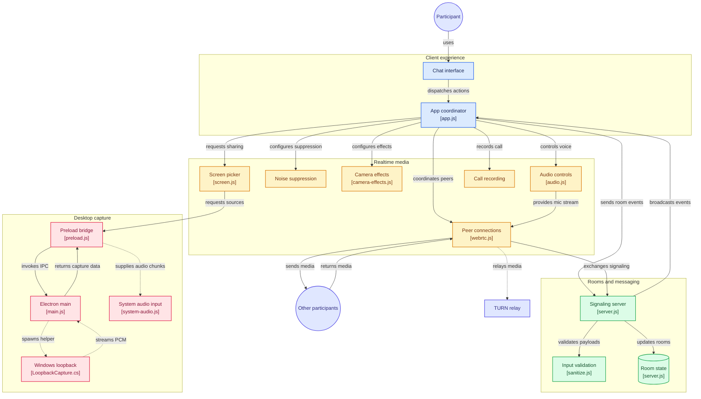

```mermaid
flowchart TD

subgraph group_client["Client experience"]
  node_app["App coordinator<br/>[app.js]"]
  node_ui["Chat interface"]
end

subgraph group_media["Realtime media"]
  node_audio["Audio controls<br/>[audio.js]"]
  node_noise["Noise suppression"]
  node_camera["Camera effects<br/>[camera-effects.js]"]
  node_screen["Screen picker<br/>[screen.js]"]
  node_rtc["Peer connections<br/>[webrtc.js]"]
  node_recorder["Call recording"]
end

subgraph group_server["Rooms and messaging"]
  node_server["Signaling server<br/>[server.js]"]
  node_sanitize["Input validation<br/>[sanitize.js]"]
  node_roomstate[("Room state<br/>[server.js]")]
end

subgraph group_desktop["Desktop capture"]
  node_electron["Electron main<br/>[main.js]"]
  node_bridge["Preload bridge<br/>[preload.js]"]
  node_native["Windows loopback<br/>[LoopbackCapture.cs]"]
  node_systemaudio["System audio input<br/>[system-audio.js]"]
end

node_user(("Participant"))
node_peers(("Other participants"))
node_turn["TURN relay"]

node_user -->|"uses"| node_ui
node_ui -->|"dispatches actions"| node_app
node_app -->|"sends room events"| node_server
node_server -->|"validates payloads"| node_sanitize
node_server -->|"updates rooms"| node_roomstate
node_server -->|"broadcasts events"| node_app
node_app -->|"coordinates peers"| node_rtc
node_rtc -->|"exchanges signaling"| node_server
node_rtc -->|"sends media"| node_peers
node_peers -->|"returns media"| node_rtc
node_app -->|"controls voice"| node_audio
node_audio -->|"provides mic stream"| node_rtc
node_app -->|"configures suppression"| node_noise
node_app -->|"configures effects"| node_camera
node_app -->|"requests sharing"| node_screen
node_screen -->|"requests sources"| node_bridge
node_bridge -->|"invokes IPC"| node_electron
node_electron -->|"returns capture data"| node_bridge
node_electron -.->|"spawns helper"| node_native
node_native -.->|"streams PCM"| node_electron
node_bridge -.->|"supplies audio chunks"| node_systemaudio
node_app -->|"records call"| node_recorder
node_rtc -.->|"relays media"| node_turn

click node_app "https://github.com/otremba/triscord/blob/main/src/renderer/js/app.js"
click node_ui "https://github.com/otremba/triscord/tree/main/src/renderer"
click node_audio "https://github.com/otremba/triscord/blob/main/src/renderer/js/audio.js"
click node_noise "https://github.com/otremba/triscord/blob/main/src/renderer/js/noise-suppression.js"
click node_camera "https://github.com/otremba/triscord/blob/main/src/renderer/js/camera-effects.js"
click node_screen "https://github.com/otremba/triscord/blob/main/src/renderer/js/screen.js"
click node_rtc "https://github.com/otremba/triscord/blob/main/src/renderer/js/webrtc.js"
click node_recorder "https://github.com/otremba/triscord/tree/main/src/renderer/js"
click node_server "https://github.com/otremba/triscord/blob/main/server/server.js"
click node_sanitize "https://github.com/otremba/triscord/blob/main/server/sanitize.js"
click node_roomstate "https://github.com/otremba/triscord/blob/main/server/server.js"
click node_electron "https://github.com/otremba/triscord/blob/main/src/main.js"
click node_bridge "https://github.com/otremba/triscord/blob/main/src/preload.js"
click node_native "https://github.com/otremba/triscord/blob/main/native/loopback-capture/LoopbackCapture.cs"
click node_systemaudio "https://github.com/otremba/triscord/blob/main/src/renderer/js/system-audio.js"

classDef toneNeutral fill:#f8fafc,stroke:#334155,stroke-width:1.5px,color:#0f172a
classDef toneBlue fill:#dbeafe,stroke:#2563eb,stroke-width:1.5px,color:#172554
classDef toneAmber fill:#fef3c7,stroke:#d97706,stroke-width:1.5px,color:#78350f
classDef toneMint fill:#dcfce7,stroke:#16a34a,stroke-width:1.5px,color:#14532d
classDef toneRose fill:#ffe4e6,stroke:#e11d48,stroke-width:1.5px,color:#881337
classDef toneIndigo fill:#e0e7ff,stroke:#4f46e5,stroke-width:1.5px,color:#312e81
classDef toneTeal fill:#ccfbf1,stroke:#0f766e,stroke-width:1.5px,color:#134e4a
class node_app,node_ui toneBlue
class node_audio,node_noise,node_camera,node_screen,node_rtc,node_recorder toneAmber
class node_server,node_sanitize,node_roomstate toneMint
class node_electron,node_bridge,node_native,node_systemaudio toneRose
class node_user,node_peers,node_turn toneIndigo
```